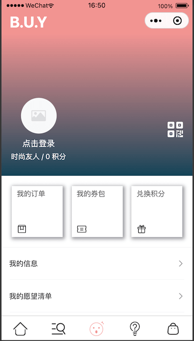

## B.U.Y商城（微信小程序端）
***

###描述（自学的练手项目）
- 页面参考了多个网站和小程序设计，有13个页面具有商城的大多功能
- 使用vant UI样式
- 页面跳转数据预加载
- 长列表式的数据展示
- 上拉加载
- 等等。。。。
***

###页面
- index 入口
- home 首页
- mall 商城
- mall/category 商品分类
- goodsDetail 商品详情
- collection 收藏
- search 搜索
- profile 个人
- profile/userinfo 用户信息
- profile/address 全部地址
- help 帮助
- bag 购物包
- pay 支付

***
####进入WechatTools 导入体验

